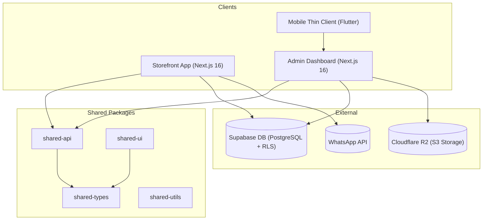

# Mazhavil Costumes - System Architecture

This document describes the technical architecture, design patterns, and engineering standards for the **Mazhavil Costumes** monorepo codebase.

---

## 1. System Overview

Mazhavil Costumes uses a modern monorepo layout powered by `pnpm workspaces` and `Turborepo`.



### Module Structure
* **`apps/admin`**: Next.js App Router admin application. Operates at port `3001`.
* **`apps/storefront`**: Customer-facing rental interface. Operates at port `3002`.
* **`apps/mobile`**: Staff mobile companion written in Flutter.
* **`packages/shared-api`**: Shared Supabase queries, mutations, and API clients.
* **`packages/shared-types`**: Shared TypeScript definitions.
* **`packages/shared-ui`**: Shared Design System assets and UI primitives.
* **`packages/shared-utils`**: Common utility functions.

---

## 2. Next.js Architecture (Admin & Storefront)

Both web applications follow a strict **5-Layer Architecture** pattern. Client-side components communicate with Next.js REST API routes, while server-side rendering/actions can access services directly.

```
Domain ➔ Repository ➔ Service ➔ Hooks ➔ Components/Pages
```

### Layer Roles and Responsibilities

| Layer | Location | Purpose | Constraints |
|---|---|---|---|
| **Domain** | `domain/` | Zod validation schemas, TypeScript interfaces, type-guards, and default values. | Pure functions and static definitions. **Must not** import from other layers. |
| **Repository** | `repository/` | Direct database transactions (Supabase CRUD). Inherits from `BaseRepository`. | No business logic. Returns `RepositoryResult<T>` instead of throwing. |
| **Service** | `services/` | Business validation, slug conflict resolution, parent-level checks, deleting dependency evaluations. | Orchestrates multiple repositories if needed. Returns formatted error codes. |
| **Hooks** | `hooks/` | TanStack Query wrapper layers handling fetching, caching, and optimistic mutations. | Displays UI notices (Toasts) via the Zustand store. |
| **Components** | `components/` | React pages and UI widgets. | **Must not** query Supabase or Repositories directly. Always uses Hooks. |

### Singleton Pattern
All Repositories and Services export both their class structure and a singleton instance:
```typescript
export class ProductService { ... }
export const productService = new ProductService();
```

---

## 3. Flutter Mobile Architecture (Thin Client)

The mobile companion functions as a strict UI client. It delegates all validation, security policies, and database triggers to the Next.js server.

```
View (Widget) ➔ Provider (Riverpod) ➔ Repository (Dio) ➔ Next.js API
```

### Key Rules
1. **Rivers of Riverpod**: All UI interactions trigger Riverpod state controllers. Providers handle asynchronous status states.
2. **Repositories**: Repositories wrap the Dio network client, handle error states gracefully, and map JSON payloads.
3. **No Direct Database Access**: The mobile client communicates strictly with Vercel endpoints; it does not connect to Supabase directly.
4. **Responsive Layout Constraints**: All widget definitions must wrap typography and layouts in the `Responsive.*` helper engine to guarantee multi-device support.

---

## 4. Database Schema & Security Model

The database is built on Supabase PostgreSQL.

### Row-Level Security (RLS)
* Policies are applied to isolate reads and mutations.
* Roles determine write abilities:
  * `super_admin`, `admin`, `manager`: Can write and modify categories, products, inventory, orders, and settings.
  * `staff`: Read-only access to products/categories, write access for logging customer orders and updating cleaning statuses.

### DB Operations & Custom Functions
* **Late Flags**: Database triggers run automated updates calculating order deadlines:
  ```sql
  -- Sets is_late to True when end_date < current_date and status is delivered/ongoing
  ```
* **Dashboard Operations**: Centralized RPC functions (e.g. `get_operational_dashboard_metrics`) calculate real-time inventory alerts, cleaning backlogs, and revenue statistics on the database server to prevent client-side network overload.

---

## 5. State Management Policies

| App | Use Case | Solution |
|---|---|---|
| **Web Apps** | Server State | **TanStack Query** (with `queryKeys` factory and `queryUtils` cache invalidation). |
| **Web Apps** | Client UI State | **Zustand** (sidebar states, theme toggles, notification stacks). |
| **Web Apps** | Form States | **React Hook Form** with Zod schema validation resolvers. |
| **Mobile Client** | State Management | **Riverpod** with Auto-generated notifier states. |

---

## 6. Image Management & Storage (Cloudflare R2)

Image assets are stored in Cloudflare R2 and served via CDN to prevent Next.js image proxy overheads.

```
File Selection (Max 20MB)
  ➔ Client-Side Canvas WebP Compression (<100KB)
  ➔ Parallel Upload via API (Multipart Upload to R2)
  ➔ Direct CDN serving (unoptimized: true in next.config)
```
- **CDN Serving**: Images bypass Vercel proxies entirely.
- **Optimistic Removal**: When a product is deleted, the database entries are deleted instantly and a background worker clears the corresponding image objects from Cloudflare R2 storage.
