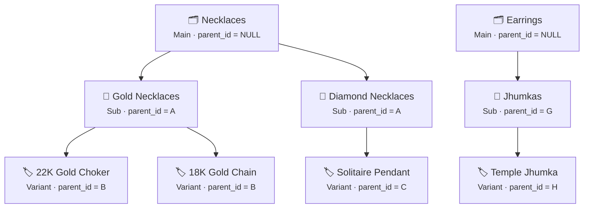
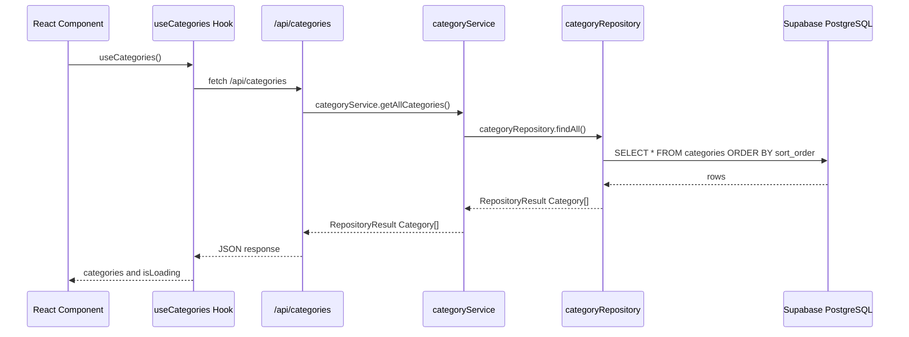
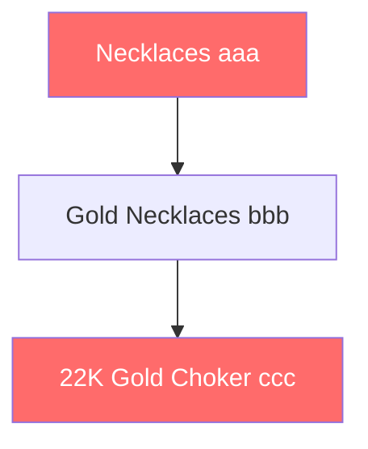

# 📚 Category Module — Technical Documentation

> **Mazhavil Costumes Admin • `apps/admin/`**
>
> This document provides an in-depth technical reference for the Categories module,
> covering every data structure, algorithm, and architectural decision with full
> computer-science theory and real-world examples.

---

## Table of Contents

1. [Module Overview](#1-module-overview)
2. [The 3-Level Hierarchy Model](#2-the-3-level-hierarchy-model)
3. [File Map & 5-Layer Architecture](#3-file-map--5-layer-architecture)
4. [Data Structure #1 — Adjacency List (Database)](#4-data-structure-1--adjacency-list-database)
5. [Data Structure #2 — N-ary Tree / Forest (Application)](#5-data-structure-2--n-ary-tree--forest-application)
6. [Algorithm #1 — O(N) Hash-Map Tree Construction](#6-algorithm-1--on-hash-map-tree-construction)
7. [Algorithm #2 — DFS Circular-Reference Detection](#7-algorithm-2--dfs-circular-reference-detection)
8. [Algorithm #3 — Linked-List Path Traversal](#8-algorithm-3--linked-list-path-traversal)
9. [Graph Theory — Directed Acyclic Graph (DAG)](#9-graph-theory--directed-acyclic-graph-dag)
10. [Validation & Business Rules](#10-validation--business-rules)
11. [API Endpoints](#11-api-endpoints)
12. [Complexity Summary](#12-complexity-summary)

---

## 1. Module Overview

The Categories module organises the costumes rental catalogue into a strict
**3-level hierarchy**. Every product in the store belongs to exactly one category.
The module enforces depth limits, prevents circular references, auto-generates
URL-friendly slugs, and blocks unsafe deletions.

### Key Constraints

| Rule | Enforcement |
|------|-------------|
| Max depth = 3 levels | Service layer blocks children under Variants |
| No circular references | DFS traversal before every parent change |
| Unique slugs | Repository `slugExists()` check before create/update |
| Safe deletes only | Repository `canDelete()` checks children + products |
| Slug format `^[a-z0-9-]+$` | Service-layer regex validation |

---

## 2. The 3-Level Hierarchy Model

```
Level 1: Main Category      (parent_id = NULL)
Level 2: Sub Category        (parent_id → Main)
Level 3: Variant             (parent_id → Sub)  ← LEAF NODE
```

### Real-World Example (Mazhavil Costumes)



**Important:** Variants are **leaf nodes** — they can never have children.
Attempting to create a child under a Variant returns error code `INVALID_PARENT_LEVEL`.

---

## 3. File Map & 5-Layer Architecture

Every feature in this monorepo follows the mandatory layered pattern:

```
Domain → Repository → Service → Hooks → Components/Pages
```

### Category Module Files

| Layer | File | Purpose |
|-------|------|---------|
| **Domain** | `domain/types/category.ts` | Types, DTOs, enums, type guards |
| **Repository** | `repository/categoryRepository.ts` | Raw Supabase CRUD, hierarchy helpers |
| **Service** | `services/categoryService.ts` | Validation, slug gen, cycle detection |
| **Hooks** | `hooks/useCategories.ts` | TanStack Query hooks, client-side tree builder |
| **API Routes** | `app/api/categories/route.ts` | REST endpoints (GET, POST) |
| **API Routes** | `app/api/categories/[id]/route.ts` | REST endpoints (GET, PATCH, DELETE) |
| **API Routes** | `app/api/categories/[id]/children/route.ts` | Children endpoint |
| **API Routes** | `app/api/categories/[id]/can-delete/route.ts` | Safety check endpoint |
| **Components** | `components/admin/CategoryForm.tsx` | Create/Edit form with image upload |
| **Components** | `components/admin/CategoryTree.tsx` | Collapsible tree viewer |
| **Components** | `components/admin/CategoryTreeActions.tsx` | Action buttons (View, Edit, Delete) |
| **Pages** | `app/dashboard/categories/page.tsx` | List page |
| **Pages** | `app/dashboard/categories/create/page.tsx` | Create page |
| **Pages** | `app/dashboard/categories/[id]/page.tsx` | Detail page |
| **Pages** | `app/dashboard/categories/edit/[id]/page.tsx` | Edit page |
| **Tests** | `scripts/test-categories-api.ps1` | 12 basic CRUD tests |
| **Tests** | `scripts/test-categories-hierarchy.ps1` | 30 hierarchy edge-case tests |

### Data Flow Diagram



---

## 4. Data Structure #1 — Adjacency List (Database)

### Theory

In graph theory, an **Adjacency List** represents a graph by storing, for each
node, a list of its neighbours. In a tree, this simplifies to each node storing
a pointer to its parent.

In relational databases, this is implemented via a **self-referencing foreign key**:

```sql
CREATE TABLE categories (
    id          UUID PRIMARY KEY DEFAULT gen_random_uuid(),
    name        TEXT NOT NULL,
    slug        TEXT NOT NULL UNIQUE,
    parent_id   UUID REFERENCES categories(id),  -- self-reference
    sort_order  INT DEFAULT 0,
    is_active   BOOLEAN DEFAULT TRUE,
    ...
);
```

### How It Looks in the Database

| id | name | slug | parent_id |
|----|------|------|-----------|
| `aaa` | Necklaces | necklaces | `NULL` |
| `bbb` | Gold Necklaces | gold-necklaces | `aaa` |
| `ccc` | Diamond Necklaces | diamond-necklaces | `aaa` |
| `ddd` | 22K Gold Choker | 22k-gold-choker | `bbb` |
| `eee` | 18K Gold Chain | 18k-gold-chain | `bbb` |
| `fff` | Solitaire Pendant | solitaire-pendant | `ccc` |
| `ggg` | Earrings | earrings | `NULL` |

### Pros and Cons

| Advantage | Disadvantage |
|-----------|-------------|
| Simple schema, easy INSERT/UPDATE | Finding all descendants requires recursion |
| Standard SQL, works with any ORM | Determining depth requires traversal |
| Each row is self-contained | Building the full tree requires app-level logic |

> **Why we chose this:** For a 3-level-max hierarchy with fewer than 1,000 categories,
> the simplicity of an adjacency list far outweighs the cost of recursive lookups.
> More complex patterns (Nested Sets, Materialised Paths, Closure Tables) add
> unnecessary schema complexity for our use case.

---

## 5. Data Structure #2 — N-ary Tree / Forest (Application)

### Theory

An **N-ary Tree** is a rooted tree where each node can have 0 to N children
(unlike a Binary Tree which limits to 2). When there are multiple root nodes,
the structure is called a **Forest**.

Our category data forms a **Forest of N-ary Trees** capped at depth 3:

```
Forest
├── Tree 1 (Necklaces)
│   ├── Gold Necklaces
│   │   ├── 22K Gold Choker     ← leaf
│   │   └── 18K Gold Chain      ← leaf
│   └── Diamond Necklaces
│       └── Solitaire Pendant   ← leaf
└── Tree 2 (Earrings)
    └── Jhumkas
        └── Temple Jhumka       ← leaf
```

### TypeScript Representation

```typescript
// domain/types/category.ts
interface CategoryTreeNode {
  category: Category;
  children: CategoryTreeNode[];  // N children
  level: number;                 // 0, 1, or 2
  isExpanded: boolean;
  productCount: number;
}
```

The `children` array is what makes this an N-ary tree. Each node holds a
reference to all of its direct children, forming a recursive structure.

---

## 6. Algorithm #1 — O(N) Hash-Map Tree Construction

### The Problem

Given a **flat array** of categories from the database (adjacency list), convert
it into a **nested tree** structure for the UI.

### The Naive Approach — O(N squared)

```
For each category:
    For each other category:
        if other.parent_id === category.id:
            add other to category.children
```

This is O(N squared) — for 500 categories, that is 250,000 comparisons.

### Our Approach — O(N) Two-Pass Hash Map

**File:** `services/categoryService.ts` line 72 `buildHierarchyTree()`

**File:** `hooks/useCategories.ts` line 223 `useCategoryTree()` `buildTree()`

```
PASS 1: Build a Hash Map   { id -> CategoryNode }       O(N)
PASS 2: Wire parent-child links using parent_id lookups  O(N)
─────────────────────────────────────────────────────────
Total:                                                   O(N)
```

### Step-by-Step Walkthrough

Given this flat input array:

```json
[
  { "id": "aaa", "name": "Necklaces",       "parent_id": null  },
  { "id": "bbb", "name": "Gold Necklaces",  "parent_id": "aaa" },
  { "id": "ccc", "name": "22K Gold Choker",  "parent_id": "bbb" },
  { "id": "ddd", "name": "Earrings",        "parent_id": null  }
]
```

**Pass 1 — Build the Map:**

```
HashMap = {
  "aaa" -> { name: "Necklaces",       children: [] },
  "bbb" -> { name: "Gold Necklaces",  children: [] },
  "ccc" -> { name: "22K Gold Choker", children: [] },
  "ddd" -> { name: "Earrings",        children: [] },
}
roots = []
```

**Pass 2 — Wire Links:**

| Category | parent_id | Action |
|----------|-----------|--------|
| Necklaces | `null` | Push to `roots[]` |
| Gold Necklaces | `aaa` | Lookup `aaa` in map, push into its `children` |
| 22K Gold Choker | `bbb` | Lookup `bbb` in map, push into its `children` |
| Earrings | `null` | Push to `roots[]` |

**Result:**

```json
[
  {
    "name": "Necklaces",
    "children": [
      {
        "name": "Gold Necklaces",
        "children": [
          { "name": "22K Gold Choker", "children": [] }
        ]
      }
    ]
  },
  {
    "name": "Earrings",
    "children": []
  }
]
```

### Complexity Analysis

| Metric | Value |
|--------|-------|
| **Time** | O(N) — two linear passes |
| **Space** | O(N) — one Map entry per category |
| **Lookups** | O(1) per parent_id (Hash Map) |

---

## 7. Algorithm #2 — DFS Circular-Reference Detection

### The Problem

When a user moves **Category A** under a new parent **Category B**, we must
verify that B is NOT a descendant of A. Otherwise we create an infinite loop.

### Theory — Depth-First Search (DFS)

**DFS** is a graph traversal algorithm that explores as far as possible along
each branch before backtracking. It uses a **stack** (or recursion) to track
the current path.

**File:** `services/categoryService.ts` line 490 `wouldCreateCircularReference()`

### How It Works

```
function wouldCreateCircularReference(categoryId, newParentId):
    descendants = getAllDescendants(categoryId)   // DFS
    return descendants.includes(newParentId)
```

The `getAllDescendants()` function performs a recursive DFS:

```
function getAllDescendants(parentId):
    children = findChildren(parentId)             // DB query
    for each child in children:
        collect(child)
        getAllDescendants(child.id)                // recurse deeper
    return collected
```

### Worked Example

Consider moving "Necklaces" (id=`aaa`) under "22K Gold Choker" (id=`ccc`):



**Step 1:** Get all descendants of `aaa` (Necklaces):

```
DFS(aaa):
  child: bbb (Gold Necklaces)
    DFS(bbb):
      child: ccc (22K Gold Choker)
        DFS(ccc):
          no children, return

Descendants = [bbb, ccc]
```

**Step 2:** Check if `ccc` (new parent) is in descendants — **YES!**

**Result:** Operation blocked with error code `CIRCULAR_REFERENCE`.

### Complexity

| Metric | Value |
|--------|-------|
| **Time** | O(D) where D = number of descendants |
| **Space** | O(D) for the collected array + O(L) call stack where L = depth |
| **Worst case** | O(N) if the category is the root of a very wide tree |

> **Note:** With a max depth of 3, the DFS never goes deeper than 2 recursive
> calls, making this effectively O(1) in practice.

---

## 8. Algorithm #3 — Linked-List Path Traversal

### The Problem

Generate a human-readable breadcrumb path like:

```
"Necklaces > Gold Necklaces > 22K Gold Choker"
```

### Theory — Singly Linked List Traversal

Each category's `parent_id` acts as a "next pointer" — but pointing **upward**
rather than forward. Starting at any node, we follow the chain of `parent_id`
pointers until we reach `null` (the root).

**File:** `repository/categoryRepository.ts` line 309 `buildCategoryPath()`

```
function buildCategoryPath(category, allCategories):
    path = []
    current = category

    while current exists:
        path.prepend(current.name)          // add to front
        current = lookup(current.parent_id) // follow pointer

    return path.join(" > ")
```

### Worked Example

Starting from "22K Gold Choker" (id=`ccc`):

```
Step 1: current = ccc ("22K Gold Choker")
        path = ["22K Gold Choker"]
        parent_id = bbb, follow pointer

Step 2: current = bbb ("Gold Necklaces")
        path = ["Gold Necklaces", "22K Gold Choker"]
        parent_id = aaa, follow pointer

Step 3: current = aaa ("Necklaces")
        path = ["Necklaces", "Gold Necklaces", "22K Gold Choker"]
        parent_id = null, STOP

Result: "Necklaces > Gold Necklaces > 22K Gold Choker"
```

### Complexity

| Metric | Value |
|--------|-------|
| **Time** | O(L) where L = depth of the node (max 3) |
| **Space** | O(L) for the path array |

---

## 9. Graph Theory — Directed Acyclic Graph (DAG)

### What Is a DAG?

A **Directed Acyclic Graph** is a graph where:
- **Directed:** Edges have a direction (Parent to Child)
- **Acyclic:** There are no cycles (no path leads back to itself)

Our category hierarchy is a special case of a DAG — specifically, a **Forest
of Rooted Trees**. Every DAG invariant we enforce:

| Property | How We Enforce It |
|----------|------------------|
| Directed | `parent_id` always points from child to parent |
| Acyclic | DFS cycle detection before every `parent_id` update |
| Max depth = 3 | Service blocks children under Variants (`INVALID_PARENT_LEVEL`) |
| Each node has at most 1 parent | Database schema: single `parent_id` column |
| No self-loops | Service check: `parent_id !== id` (`CIRCULAR_REFERENCE`) |

---

## 10. Validation & Business Rules

### Service-Layer Validation (categoryService.ts)

| Field | Rule | Error Code |
|-------|------|-----------|
| `name` | Required, max 100 chars | `NAME_REQUIRED`, `NAME_TOO_LONG` |
| `slug` | Regex `/^[a-z0-9-]+$/` | `INVALID_SLUG_FORMAT` |
| `slug` | Must be unique across all categories | `SLUG_EXISTS` |
| `description` | Max 1,000 chars | `DESCRIPTION_TOO_LONG` |
| `sort_order` | Must be >= 0 | `INVALID_SORT_ORDER` |
| `parent_id` | Must reference a valid category | `INVALID_PARENT` |
| `parent_id` | Cannot point to a Variant | `INVALID_PARENT_LEVEL` |
| `parent_id` | Cannot create a cycle | `CIRCULAR_REFERENCE` |

### Delete Safety Check (categoryRepository.ts canDelete)

Before any deletion, the system checks:

```
Can Delete? = (childCount === 0) AND (productCount === 0)
```

| Condition | HTTP Response | Error Code |
|-----------|--------------|-----------|
| Has child categories | 409 Conflict | `CANNOT_DELETE` |
| Has linked products | 409 Conflict | `CANNOT_DELETE` |
| Both children + products | 409 Conflict | `CANNOT_DELETE` |
| Neither | 200 OK | Proceeds with delete |

### Slug Auto-Generation

```
Input:  "22K Gold Choker Set!"
Output: "22k-gold-choker-set"

Steps:
  1. toLowerCase()                "22k gold choker set!"
  2. trim()                       "22k gold choker set!"
  3. replace spaces with hyphens  "22k-gold-choker-set!"
  4. remove non-alphanumeric      "22k-gold-choker-set"
  5. collapse double hyphens      "22k-gold-choker-set"
```

---

## 11. API Endpoints

| Method | Endpoint | Purpose | Service Method |
|--------|----------|---------|----------------|
| `GET` | `/api/categories` | List all categories | `getAllCategories()` |
| `POST` | `/api/categories` | Create category | `createCategory()` |
| `GET` | `/api/categories/:id` | Get by ID with relations | `getCategoryById()` |
| `PATCH` | `/api/categories/:id` | Update category | `updateCategory()` |
| `DELETE` | `/api/categories/:id` | Delete with safety check | `deleteCategory()` |
| `GET` | `/api/categories/:id/children` | Get direct children | `getCategoryChildren()` |
| `GET` | `/api/categories/:id/can-delete` | Pre-delete safety check | `canDeleteCategory()` |

### PATCH Field Whitelist

Only these fields can be updated via PATCH:

```typescript
const allowedFields = [
  'name', 'slug', 'description', 'image_url',
  'parent_id', 'sort_order', 'is_active'
];
```

---

## 12. Complexity Summary

| Operation | Algorithm | Time | Space |
|-----------|-----------|------|-------|
| Build tree from flat list | Two-Pass Hash Map | **O(N)** | O(N) |
| Check circular reference | DFS traversal | **O(D)** | O(D) |
| Generate breadcrumb path | Linked-list walk | **O(L)** | O(L) |
| Find category by ID | Supabase `.eq('id')` | **O(1)** indexed | O(1) |
| Check slug uniqueness | Supabase `.eq('slug')` | **O(1)** indexed | O(1) |
| Delete safety check | Two COUNT queries | **O(1)** indexed | O(1) |
| Build hierarchy (mains/subs/variants) | Three filter passes | **O(N)** | O(N) |

Where:
- **N** = total number of categories
- **D** = number of descendants of a specific category (worst case N)
- **L** = depth of a category in the tree (max 3)

---

> **Bottom Line:** The Categories module uses well-established computer science
> patterns — Hash Map construction, DFS cycle detection, and Linked-List traversal —
> all operating at optimal time complexity. The 3-level depth cap means that in
> practice, every "theoretical O(N)" operation runs in near-constant time.
