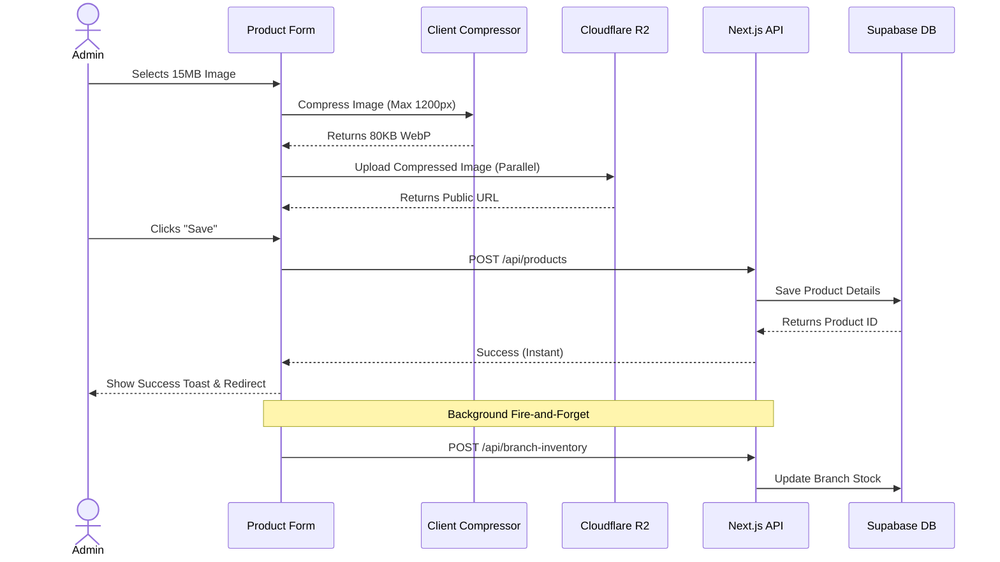
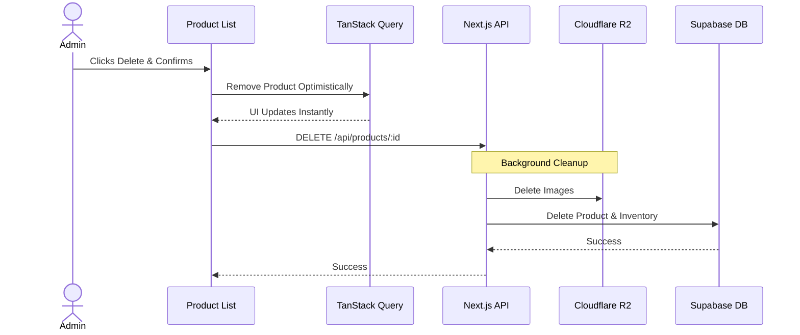

# Product Management Module Documentation

The Product Module is the core of the Mazhavil Costumes Admin Dashboard, designed to manage high-value rental costumes. It features advanced stock tracking across multiple branches, instant saving, parallel image processing, and a highly optimized user experience.

## 🌟 Key Features

1. **Instant Save (Fire-and-Forget)**
   - Product details save instantly.
   - Branch inventory synchronization happens in the background.
   - Cache invalidation ensures the product list is immediately updated.

2. **Client-Side Image Processing**
   - Images up to 20MB are supported.
   - Uses the Canvas API to compress images client-side to WebP (<100KB) *before* uploading.
   - Parallel uploads to Cloudflare R2 reduce 8-second upload times to under 1 second.

3. **Optimistic Deletion**
   - Products are instantly removed from the UI cache before the API responds.
   - Images are automatically cleaned up from Cloudflare R2 in the background.
   - Branch inventory caches are purged to prevent ghost stock.

4. **Server-Side Pagination & Search**
   - 25/50/100 items per page with Next/Prev buttons.
   - Debounced search (300ms) with zero UI flickering thanks to `placeholderData`.
   - Complex filtering across branches, prices, and categories.

---

## 🔄 User Flows

### 1. Product Creation Flow

### 2. Product Deletion Flow

---

## 🏗 Architecture Details

### The 5-Layer Strict Pattern
The module adheres to the mandatory 5-layer architecture:

1. **UI Components (`components/admin/ProductForm.tsx`)**
   - Direct `fetch` calls for mutations to avoid TanStack `mutateAsync` overhead.
   - Manages local state (form data, image URLs, branch stock).
   - Handles client-side compression.

2. **Hooks (`hooks/useProducts.ts`)**
   - Uses TanStack Query for data fetching.
   - `refetchOnMount: 'always'` ensures fresh data on navigation.
   - Implements optimistic updates for deletion.

3. **API Routes (`app/api/products/route.ts`)**
   - RESTful boundaries.
   - Request validation via Zod schemas.

4. **Service Layer (`services/productService.ts`)**
   - Business logic, slug generation, and validation.

5. **Repository Layer (`repository/productRepository.ts`)**
   - Raw database interactions extending `BaseRepository`.
   - Handles complex filtering and pagination queries.

---

## 📊 Database Schema Summary

The module interacts with three main tables:
1. `products`: Core product details (name, slug, price, images JSONB).
2. `categories`: Foreign key relationships for hierarchy.
3. `branch_inventory`: Junction table mapping products to specific store branches and tracking available/total quantities.

---

## ⚡ Performance Optimizations Implemented

- **No Next.js Image Proxy**: By setting `unoptimized: true` in `next.config.ts`, images are served directly from the Cloudflare R2 CDN, avoiding Next.js Vercel proxy timeouts (which previously caused 7s loads and 500 errors).
- **Parallel Uploads**: Swapped sequential `for` loops with `Promise.all` for uploading multiple images simultaneously.
- **Cache Wiping**: Used `queryClient.removeQueries` instead of `invalidateQueries` to force a hard refetch on navigation, guaranteeing the newly created product is visible immediately without a stale cache flash.
