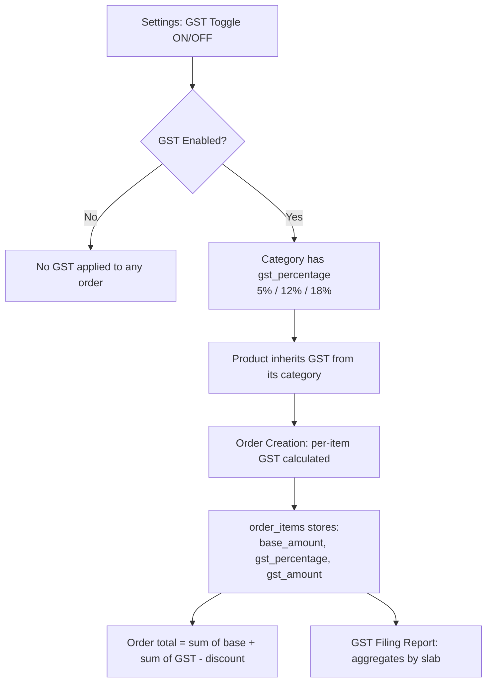

# Mazhavil Costumes — Implementation Plan v2 (GST, RBAC & Reporting Corrections)

> **Created:** 2026-05-04 | **Total Phases:** 6 | **Estimate:** ~14 hrs

---

## Summary of Changes

| Area | What Changes |
|------|-------------|
| **Settings** | Remove GST percentage input; keep only the ON/OFF toggle |
| **Categories** | Add `gst_percentage` dropdown (5%, 12%, 18%) to category create/edit |
| **Products** | Remove edit for staff/manager; make category, stock, amount mandatory; remove branch-level inventory; inherit GST from category |
| **Orders** | Show per-item GST breakdown (base + GST) using category GST rates |
| **Staff** | Remove discount permission toggles; all staff can give discounts; track order placement + discount stats per staff |
| **Reports** | New R12: GST Filing Report (base vs GST separation); add charts to R3, R4, R6, R9 |
| **Dashboard** | Prepare Delivery → show only upcoming 5 days (not 7) |

---

## Phase Overview

| Phase | Scope | Est. | Depends On |
|-------|-------|------|------------|
| **Phase 1** | DB migration + Settings simplification | ~1.5 hr | None |
| **Phase 2** | Category GST field | ~2 hrs | Phase 1 |
| **Phase 3** | Product module corrections | ~2.5 hrs | Phase 2 |
| **Phase 4** | Order module — per-item GST breakdown | ~3 hrs | Phase 2, 3 |
| **Phase 5** | Staff — remove discount gates, add tracking | ~2 hrs | Phase 1 |
| **Phase 6** | Reports (GST Filing) + Dashboard fix | ~3 hrs | Phase 4, 5 |

---

## Phase 1: Database Migration + Settings Simplification

**Goal:** Add `gst_percentage` to categories, remove staff discount toggles, add staff order tracking columns, simplify settings page.

### Step 1A: Database Migration (`009_gst_and_corrections.sql`)

```sql
-- 1. Categories: add GST percentage (default 5%)
ALTER TABLE categories ADD COLUMN IF NOT EXISTS gst_percentage DECIMAL(5,2) DEFAULT 5.00;

-- 2. Order Items: add GST tracking fields
ALTER TABLE order_items ADD COLUMN IF NOT EXISTS gst_percentage DECIMAL(5,2) DEFAULT 0;
ALTER TABLE order_items ADD COLUMN IF NOT EXISTS base_amount DECIMAL(10,2) DEFAULT 0;
ALTER TABLE order_items ADD COLUMN IF NOT EXISTS gst_amount DECIMAL(10,2) DEFAULT 0;

-- 3. Staff: remove discount permission columns (all staff can now give discounts)
ALTER TABLE staff DROP COLUMN IF EXISTS can_give_product_discount;
ALTER TABLE staff DROP COLUMN IF EXISTS can_give_order_discount;

-- 4. Remove the gst_percentage setting key (GST rate now lives on categories)
-- The is_gst_enabled setting key remains (global toggle)
DELETE FROM settings WHERE key = 'gst_percentage';

-- 5. Drop branch-level product_inventory (stock is now common across branches)
-- NOTE: Migrate any existing data first if needed
-- DROP TABLE IF EXISTS product_inventory;
-- (Keep table but stop using it — safer approach)
```

### Step 1B: Settings Page — Remove GST Percentage Input

**File:** `app/dashboard/settings/page.tsx`

Changes:
- **Remove** the `useGSTPercentage` and `useUpdateGSTPercentage` hooks usage
- **Remove** the GST percentage input field (lines ~107-126)
- **Keep** only the GST enabled/disabled toggle
- Update `handleSaveGST` to only save the `is_gst_enabled` value
- Remove `gstPercentage` state variable

**File:** `services/settingsService.ts`
- Remove `getGSTPercentage()` and `setGSTPercentage()` methods
- Keep `getIsGSTEnabled()` and `setIsGSTEnabled()`

**File:** `domain/types/settings.ts`
- Remove `GST_PERCENTAGE` from `SettingKey` enum

**File:** `hooks/useSettings.ts` (or wherever GST hooks live)
- Remove `useGSTPercentage` and `useUpdateGSTPercentage` hooks

### Files Modified in Phase 1

| File | Change |
|------|--------|
| `database/migrations/009_gst_and_corrections.sql` | **New** — schema changes |
| `app/dashboard/settings/page.tsx` | Remove GST % input, keep toggle only |
| `services/settingsService.ts` | Remove GST percentage methods |
| `domain/types/settings.ts` | Remove `GST_PERCENTAGE` from enum |
| `hooks/useSettings.ts` | Remove GST percentage hooks |
| `domain/schemas/settings.schema.ts` | Remove `gst_percentage` from allowed keys |

---

## Phase 2: Category GST Field

**Goal:** Add a GST percentage dropdown to category create/edit forms. Default options: 5%, 12%, 18%.

### Step 2A: Domain Layer Updates

**File:** `domain/types/category.ts`

```typescript
// Add to Category interface:
gst_percentage: number; // 5, 12, or 18

// Add to CreateCategoryDTO:
gst_percentage?: number;

// Add to UpdateCategoryDTO:
gst_percentage?: number;

// Add GST options constant:
export const GST_OPTIONS = [
  { value: 5, label: '5%' },
  { value: 12, label: '12%' },
  { value: 18, label: '18%' },
] as const;
```

### Step 2B: Category Form UI

**File:** `components/admin/CategoryForm.tsx`

Add a "GST Rate" dropdown after the existing fields:
- Label: "GST Rate"
- Options: 5%, 12%, 18%
- Default: 5%
- Helper text: "GST percentage applied to all products under this category"
- The dropdown uses a `<select>` or shadcn `Select` component

### Step 2C: Service + Repository + API

**File:** `services/categoryService.ts`
- Accept `gst_percentage` in create/update methods
- Validate: must be one of [5, 12, 18]

**File:** `repository/categoryRepository.ts`
- Include `gst_percentage` in insert/update/select queries

**File:** `app/api/categories/route.ts` + `[id]/route.ts`
- Add `gst_percentage` to POST/PATCH whitelist
- Return `gst_percentage` in GET responses

### Step 2D: Category List/Tree Display

**File:** `components/admin/CategoryTree.tsx`
- Show GST badge (e.g., "5% GST") next to each category name

### Files Modified in Phase 2

| File | Change |
|------|--------|
| `domain/types/category.ts` | Add `gst_percentage` to interfaces + GST_OPTIONS constant |
| `components/admin/CategoryForm.tsx` | Add GST dropdown field |
| `services/categoryService.ts` | Accept + validate `gst_percentage` |
| `repository/categoryRepository.ts` | Include `gst_percentage` in queries |
| `app/api/categories/route.ts` | Whitelist `gst_percentage` in POST |
| `app/api/categories/[id]/route.ts` | Whitelist `gst_percentage` in PATCH |
| `components/admin/CategoryTree.tsx` | Show GST badge |

---

## Phase 3: Product Module Corrections

**Goal:** Remove edit for staff/manager, make fields mandatory, remove branch inventory, inherit GST from category.

### Step 3A: RBAC — Remove Edit for Staff & Manager

**File:** `app/dashboard/products/[id]/page.tsx` (product detail)
- Hide "Edit" button when role is `staff` or `manager`
- Only `admin` and `super_admin` can see the edit button

**File:** `app/dashboard/products/page.tsx` (product list)
- Hide edit actions (edit icon/link) for staff/manager
- Keep view access for all roles

**File:** `components/admin/ProductForm.tsx`
- Add role check; if user is staff/manager in edit mode, redirect to product detail

> [!IMPORTANT]
> The RBAC Access Matrix is updated:
> | Products | Admin: Full CRUD | Manager: View + Create only | Staff: View + Create only |

### Step 3B: Mandatory Fields Validation

**File:** `components/admin/ProductForm.tsx`

Make these fields required with validation:
- **Category** (`category_id`) — must select at least main category
- **Stock** (`quantity`) — must be > 0
- **Amount** (`price_per_day`) — must be > 0

Add `required` attribute + form validation:
```typescript
// Before submit:
if (!formData.category_id) errors.push('Category is required');
if (!formData.quantity || formData.quantity <= 0) errors.push('Stock quantity is required');
if (!formData.price_per_day || formData.price_per_day <= 0) errors.push('Rent amount is required');
```

**File:** `services/productService.ts`
- Add server-side validation for the same 3 mandatory fields
- Return `VALIDATION_ERROR` if missing

### Step 3C: Remove Branch-Level Inventory

**File:** `components/admin/ProductForm.tsx`
- Remove the branch inventory section (per-branch stock allocation UI)
- The `quantity` field on the product itself is the single source of truth for all branches
- Remove `branch_inventory` from form state and submission payload

**File:** `services/productService.ts`
- Stop creating/updating `product_inventory` table entries
- Remove `branchInventoryService` calls during product creation/edit

**File:** `domain/types/product.ts`
- Remove `branch_inventory` from `CreateProductDTO` and `UpdateProductDTO`
- Remove `removed_inventory_ids` from `UpdateProductDTO`

### Step 3D: GST Inheritance from Category

When a product is under a category, it inherits that category's `gst_percentage`.
- No GST field on the product form itself
- During order creation, the system reads the category's GST rate for each product
- Display info text on product form: "GST rate: X% (inherited from category: CategoryName)"

**File:** `components/admin/ProductForm.tsx`
- Show read-only GST info when category is selected
- Fetch category's `gst_percentage` when category changes

### Files Modified in Phase 3

| File | Change |
|------|--------|
| `app/dashboard/products/[id]/page.tsx` | Hide edit button for staff/manager |
| `app/dashboard/products/page.tsx` | Hide edit actions for staff/manager |
| `components/admin/ProductForm.tsx` | Mandatory fields, remove branch inventory, show GST info |
| `services/productService.ts` | Server-side mandatory validation, remove branch inventory |
| `domain/types/product.ts` | Remove `branch_inventory` from DTOs |
| `lib/permissions.ts` | Update product permissions for staff/manager |

---

## Phase 4: Order Module — Per-Item GST Breakdown

**Goal:** Apply category-level GST per product item; show GST separation in order view.

### Step 4A: GST Calculation During Order Creation

**File:** `components/admin/OrderForm.tsx`

When items are added to the cart:
1. Look up the product's category → get `gst_percentage`
2. Check global `is_gst_enabled` setting
3. If GST is enabled, calculate per-item:

```
base_amount = price_per_day × quantity
gst_amount = base_amount × (gst_percentage / 100)
item_total = base_amount + gst_amount
```

4. Display in cart table:

```
┌──────────────────────────────────────────────────────────────────┐
│ Product        Qty   Rate    Base     GST(%)   GST Amt   Total  │
│ ─────────────────────────────────────────────────────────────────│
│ Gold Necklace   1    ₹500    ₹500    18%      ₹90       ₹590   │
│ Silver Bangle   2    ₹200    ₹400    5%       ₹20       ₹420   │
│ ─────────────────────────────────────────────────────────────────│
│                          Subtotal (Base):              ₹900     │
│                          Total GST:                    ₹110     │
│                          ────────────────────────────────────── │
│                          Gross Total:                  ₹1,010   │
│                          Discount:                     -₹50     │
│                          Grand Total:                  ₹960     │
└──────────────────────────────────────────────────────────────────┘
```

### Step 4B: Store GST Data in Order Items

**File:** `services/orderService.ts`

On order creation/update:
- Store `gst_percentage`, `base_amount`, `gst_amount` per order_item
- Calculate order-level `gst_amount` as sum of all item GST amounts
- Store order-level `subtotal` (sum of base amounts) and `gst_amount`

**File:** `repository/orderRepository.ts`
- Include new fields in insert/update for order_items

### Step 4C: Order Details View — GST Breakdown

**File:** `components/admin/OrderDetailsView.tsx`

Show per-item GST breakdown in the order detail receipt:
- Add "Base", "GST %", "GST Amt" columns to items table
- Show totals breakdown: Subtotal (base) → GST Total → Gross → Discount → Grand Total

### Step 4D: Invoice — GST Separation

**File:** `services/invoiceService.ts`
- Include GST breakdown in invoice PDF/print
- Show CGST + SGST split (each = GST/2 for intra-state) if needed later

### Files Modified in Phase 4

| File | Change |
|------|--------|
| `components/admin/OrderForm.tsx` | Per-item GST calculation + display |
| `components/admin/OrderDetailsView.tsx` | GST breakdown columns |
| `services/orderService.ts` | Store per-item GST data |
| `repository/orderRepository.ts` | Include GST fields in queries |
| `services/invoiceService.ts` | GST in invoice |
| `domain/types/order.ts` | Add GST fields to OrderItem interface |

---

## Phase 5: Staff — Remove Discount Gates + Add Tracking

**Goal:** All staff can give discounts (remove permission toggles). Track orders placed & discounts given per staff.

### Step 5A: Remove Discount Permission Toggles

**File:** `components/admin/StaffForm.tsx`
- Remove the "Discount Permissions" section with the two toggles
- Remove `can_give_product_discount` and `can_give_order_discount` from form state

**File:** `domain/types/branch.ts`
- Remove `can_give_product_discount` and `can_give_order_discount` from `Staff` interface
- Remove from `UpdateStaffDTO`

**File:** `stores/appStore.ts`
- Remove discount fields from `User` interface

**File:** `lib/auth.ts`
- Remove fetching of discount permission columns

**File:** `hooks/useDiscountPermission.ts` (if exists)
- **Delete** this file

**File:** `components/admin/OrderForm.tsx`
- Remove all discount permission checks — discount fields are always visible to all roles

### Step 5B: Staff Order & Discount Tracking

Track per staff member:
- How many orders they placed
- Total discount amount they gave

This data already exists in the database:
- `orders.created_by` → links to staff ID
- `orders.discount` → order-level discount
- `order_items.discount` → item-level discount

**File:** `services/staffService.ts` — Add new method:

```typescript
async getStaffOrderStats(staffId: string): Promise<{
  totalOrders: number;
  totalDiscount: number;
  avgDiscountPerOrder: number;
  recentOrders: { id: string; date: string; total: number; discount: number }[];
}>
```

**File:** `app/api/staff/[id]/stats/route.ts` — **New** API endpoint

**File:** `app/dashboard/staff/[id]/page.tsx` — Staff detail page
- Add "Order Stats" section showing:
  - Total orders placed by this staff
  - Total discount given
  - Average discount per order
  - Recent 10 orders with discount amounts

### Files Modified in Phase 5

| File | Change |
|------|--------|
| `components/admin/StaffForm.tsx` | Remove discount toggles |
| `components/admin/OrderForm.tsx` | Remove discount permission checks |
| `domain/types/branch.ts` | Remove discount fields from Staff |
| `stores/appStore.ts` | Remove discount fields from User |
| `lib/auth.ts` | Stop fetching discount columns |
| `services/staffService.ts` | Add `getStaffOrderStats()` |
| `app/api/staff/[id]/stats/route.ts` | **New** — staff stats API |
| `app/dashboard/staff/[id]/page.tsx` | Add order stats section |
| `hooks/useDiscountPermission.ts` | **Delete** (if exists) |

---

## Phase 6: Reports (GST Filing) + Dashboard Fix

### Step 6A: New Report — R12: GST Filing Report

**Purpose:** Help the store owner calculate GST and file returns by separating base amount and GST amount per product across all orders.

**File:** `domain/types/report.ts`

```typescript
// Add to ReportType:
| 'gst-filing'  // R12

// Add to REPORT_LIST:
{ id: 'gst-filing', name: 'GST Filing Report', description: 'Base vs GST separation for filing', category: 'sale', icon: 'Receipt' }

// New row type:
export interface GSTFilingRow {
  order_id: string;
  order_date: string;
  customer_name: string;
  customer_gstin: string | null;
  product_name: string;
  category_name: string;
  hsn_code: string | null;  // Future use
  gst_percentage: number;
  base_amount: number;
  cgst_amount: number;      // gst_amount / 2
  sgst_amount: number;      // gst_amount / 2
  total_gst: number;
  total_amount: number;
}

// Summary row for GST filing:
export interface GSTFilingSummary {
  period: string;
  total_base_amount: number;
  gst_5_base: number;
  gst_5_amount: number;
  gst_12_base: number;
  gst_12_amount: number;
  gst_18_base: number;
  gst_18_amount: number;
  total_gst_collected: number;
  total_invoices: number;
}
```

**Report Features:**
1. **Filter by period:** Month/Quarter/Year/Custom date range
2. **Group by GST slab:** Separate sections for 5%, 12%, 18%
3. **Summary table at top:**

```
┌──────────────────────────────────────────────────────────────────┐
│ GST Slab  │ Taxable Value │ CGST      │ SGST      │ Total GST  │
│ ──────────│───────────────│───────────│───────────│────────────│
│ 5%        │ ₹50,000       │ ₹1,250    │ ₹1,250    │ ₹2,500     │
│ 12%       │ ₹30,000       │ ₹1,800    │ ₹1,800    │ ₹3,600     │
│ 18%       │ ₹20,000       │ ₹1,800    │ ₹1,800    │ ₹3,600     │
│ ──────────│───────────────│───────────│───────────│────────────│
│ TOTAL     │ ₹1,00,000     │ ₹4,850    │ ₹4,850    │ ₹9,700     │
└──────────────────────────────────────────────────────────────────┘
```

4. **Detailed line items below** with per-order, per-product breakdown
5. **Export:** Excel (GSTR-1 friendly format) + PDF

**File:** `services/reportService.ts` — Add `getGSTFilingReport()` method
**File:** `app/api/reports/gst-filing/route.ts` — **New** API
**File:** `app/dashboard/reports/page.tsx` — Add R12 to report list + render

### Step 6B: Charts for Existing Reports

> [!TIP]
> Reports that benefit most from graphical representation:

| Report | Chart Type | What It Shows |
|--------|-----------|---------------|
| **R3 — Revenue** | Line/Area chart | Revenue trend over time (day/week/month) |
| **R4 — Top Costumes** | Horizontal bar chart | Top 10 products by revenue or rental count |
| **R6 — Rental Frequency** | Bar chart | Products ranked by rental frequency |
| **R9 — Sales by Staff** | Bar chart + pie chart | Staff contribution comparison |

**Implementation approach:**
- Use a lightweight charting library: **Recharts** (React-native, small bundle, SSR-compatible)
- Add chart toggle: Table view ↔ Chart view
- Charts render above the data table as a visual summary

**File:** `package.json` — Add `recharts` dependency
**File:** `components/admin/ReportChart.tsx` — **New** reusable chart wrapper
**File:** `app/dashboard/reports/page.tsx` — Add chart rendering for R3, R4, R6, R9

### Step 6C: Dashboard — Prepare Delivery → 5 Days

**File:** `services/dashboardService.ts`

Change the "Prepare Delivery" card logic:
```diff
- const next7Days = endOfDay(addDays(now, 7)).toISOString();
+ const next5Days = endOfDay(addDays(now, 5)).toISOString();
```

Only show orders where `start_date` is within the **next 5 days** (not 7). This means a customer who books 30 days before the delivery date will NOT appear in "Prepare Delivery" until 5 days before their delivery date.

Also update the card label/description to clarify: "Orders scheduled for delivery in the next 5 days"

### Files Modified in Phase 6

| File | Change |
|------|--------|
| `domain/types/report.ts` | Add R12 type + `GSTFilingRow`, `GSTFilingSummary` |
| `services/reportService.ts` | Add `getGSTFilingReport()` |
| `app/api/reports/gst-filing/route.ts` | **New** — GST filing API |
| `app/dashboard/reports/page.tsx` | Add R12 + chart views |
| `components/admin/ReportChart.tsx` | **New** — reusable chart component |
| `services/dashboardService.ts` | Change Prepare Delivery from 7→5 days |
| `package.json` | Add `recharts` |

---

## Updated RBAC Access Matrix

### Screen-Level Access (Updated)

| Screen / Module | Admin | Manager | Staff |
|----------------|-------|---------|-------|
| Dashboard | ✅ Full | ✅ Ops Only | ✅ Ops Only |
| Orders | ✅ Full | ✅ Full | ✅ Full |
| Products | ✅ Full CRUD | ✅ View + Create | ✅ View + Create |
| Categories | ✅ Full CRUD | ✅ Full CRUD | ✅ Full CRUD |
| Customers | ✅ Full CRUD | ✅ Full CRUD | ✅ Full CRUD |
| Staff | ✅ Full CRUD | ✅ Full CRUD | ❌ Hidden |
| Settings | ✅ Full | ❌ Hidden | ❌ Hidden |
| Reports | ✅ Full | ✅ Full | ✅ Full |

### Feature-Level Permissions (Updated)

| Feature | Admin | Manager | Staff |
|---------|-------|---------|-------|
| **Edit products** | ✅ | ❌ | ❌ |
| **Product-level discount** | ✅ | ✅ | ✅ |
| **Order-level discount** | ✅ | ✅ | ✅ |
| **Edit item rent amount** | ✅ | ✅ | ✅ |

> [!NOTE]
> Discount permissions are no longer gated by per-staff toggles. All roles can apply discounts. Discount usage is tracked per staff for accountability.

---

## GST Flow Summary



---

## Confirmed Decisions (Updated)

| # | Decision | Status |
|---|----------|--------|
| 21 | GST percentage removed from Settings — toggle only | ✅ New |
| 22 | GST rate set per category (dropdown: 5%, 12%, 18%) | ✅ New |
| 23 | Products inherit GST from their category | ✅ New |
| 24 | All staff can give discounts (no permission toggles) | ✅ New (overrides #4) |
| 25 | Staff order placement & discount stats tracked | ✅ New |
| 26 | Product edit restricted to Admin only | ✅ New (overrides old Products RBAC) |
| 27 | Category, Stock, Amount are mandatory for products | ✅ New |
| 28 | Branch-level inventory removed; stock is global | ✅ New |
| 29 | Per-item GST breakdown shown in orders | ✅ New |
| 30 | R12: GST Filing Report with slab-wise separation | ✅ New |
| 31 | Charts added to R3, R4, R6, R9 using Recharts | ✅ New |
| 32 | Prepare Delivery shows next 5 days (not 7) | ✅ New |
---

## Phase 7: Interactive Staff Sales Dashboard

**Goal:** Create a high-performance analytics dashboard that allows managers to track staff productivity (orders placed/cancelled) and drill down into individual history.

### Step 7A: Service Layer Refactoring

**File:** `services/reportService.ts`

1. **Refactor `getSalesByStaff()`**:
   - Fetch ALL orders (including cancelled) for the period.
   - Aggregate: `placed_count` (non-cancelled), `cancelled_count` (cancelled status).
   - Calculate `revenue`, `total_discount`, and `discount_percentage` as before.
2. **New Method `getStaffOrderHistory(staffId, filters)`**:
   - Fetch detailed order list for a specific staff member.
   - Include status, customer name, total amount, and items.

### Step 7B: Domain Layer Updates

**File:** `domain/types/report.ts`

```typescript
export interface SalesByStaffRow {
  staff_id: string;
  staff_name: string;
  staff_email: string;
  order_count: number;          // Total placed (non-cancelled)
  cancelled_order_count: number; // Total cancelled
  total_revenue: number;        // From non-cancelled orders
  total_discount: number;
  discount_percentage: number;
  avg_order_value: number;
}
```

### Step 7C: UI Layer — Master-Detail View

**File:** `components/admin/reports/views/SalesByStaffReport.tsx`

1. **Master View (Main Dashboard):**
   - **Chart 1: Revenue Share % (Pie)** — Visual split of total income.
   - **Chart 2: Productivity (Bar)** — Stacked bar showing "Placed" vs "Cancelled" orders per staff.
   - **Staff Table**: Columns for Name, Orders Created, Orders Cancelled, Total Revenue.
   - **Interaction**: Make rows clickable.
2. **Detail View (Drill-down):**
   - Triggered by clicking a staff row.
   - **Top Row**: Personal stats (Cancellation rate, Avg Discount given).
   - **Order History Table**: A full list of that staff's orders (Date, Customer, Status, Amount) with links to actual Order Details.

### Files Modified in Phase 7

| File | Change |
|------|--------|
| `services/reportService.ts` | Add cancellation tracking + individual history fetcher |
| `domain/types/report.ts` | Add `cancelled_order_count` |
| `components/admin/reports/views/SalesByStaffReport.tsx` | Implement Master-Detail dashboard with 2 charts |

---

## Confirmed Decisions (Updated)

| # | Decision | Status |
|---|----------|--------|
| 33 | Sales by Staff refactored into an interactive Master-Detail dashboard | ✅ New |
| 34 | Cancellation rate and order history tracking added per staff member | ✅ New |
| 35 | Productivity chart added: Placed vs Cancelled counts | ✅ New |
